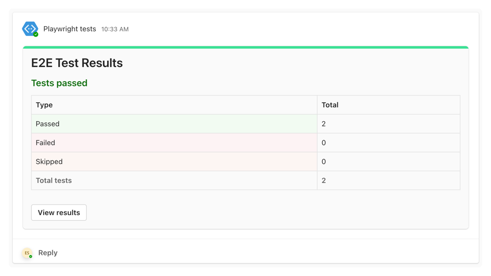
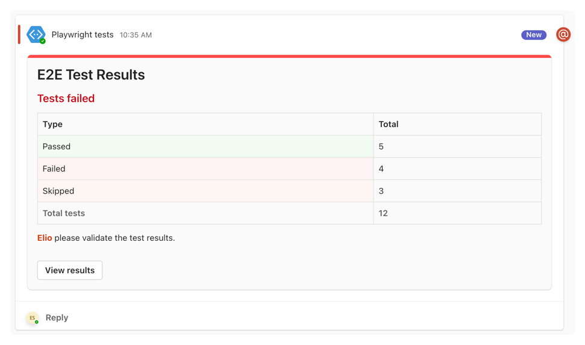

# Microsoft Teams reporter for Playwright

[](https://badge.fury.io/js/playwright-msteams-reporter)
[](https://www.npmjs.com/package/playwright-msteams-reporter)


This reporter for Playwright allows you to send the test results to a Microsoft Teams channel and mention users on failure.

Here you can see an example card for successful test results:



Here you can see an example card for failed test results:



## Prerequisites

To use this reporter, you must have a Microsoft Teams webhook URL. You can create a webhook URL using the Microsoft Teams Power Automate connector or the Microsoft Teams incoming webhook functionality.

As the incoming webhook functionality will stop working on October 1, 2024, it is recommended to use the Power Automate connector functionality.

> **Important**: You need to copy the `webhook URL` from the configuration, as you will need it to configure the reporter.

> **Info**: The [Retirement of Office 365 connectors within Microsoft Teams](https://devblogs.microsoft.com/microsoft365dev/retirement-of-office-365-connectors-within-microsoft-teams/) article provides more information on the retirement of the incoming webhook functionality.

### Microsoft Teams Power Automate webhook

To create a Power Automate webhook for Microsoft Teams, you can follow these steps:

- Start with the following [Post to a channel when a webhook request is received](https://make.preview.powerautomate.com/galleries/public/templates/d271a6f01c2545a28348d8f2cddf4c8f/post-to-a-channel-when-a-webhook-request-is-received) template
- Click continue to use the template
- Click on the **Post your own adaptive card as the Flow bot to a channel** action
- Configure the action with the following settings:
  - **Team**: Select the team where you want to post the message
  - **Channel**: Select the channel where you want to post the message

 

- Click on the **Save** button
- Click on **When a Teams webhook request is received** and copy the **HTTP URL**

### Microsoft Teams incoming webhook (retiring October 1, 2024)

To use this reporter, you need to create an incoming webhook for your Microsoft Teams channel. You can find more information on how to do this in the [Microsoft documentation](https://learn.microsoft.com/en-us/microsoftteams/platform/webhooks-and-connectors/how-to/add-incoming-webhook?tabs=newteams%2Cdotnet#create-an-incoming-webhook).

> **Important**: You need to copy the `webhook URL` from the configuration, as you will need it to configure the reporter.

## Installation

Install from npm:

```bash
npm install playwright-msteams-reporter
```

## Usage

You can configure the reporter by adding it to the `playwright.config.js` file:

```javascript
import { defineConfig } from '@playwright/test';
import type { MsTeamsReporterOptions } from "playwright-msteams-reporter";

export default defineConfig({
  reporter: [
    ['list'],
    [
      'playwright-msteams-reporter',
      <MsTeamsReporterOptions>{
        webhookUrl: "<webhookUrl>",
        webhookType: "powerautomate", // or "msteams"
      }
    ]
  ],
});
```

> More information on how to use reporters can be found in the [Playwright documentation](https://playwright.dev/docs/test-reporters).

## Configuration

The reporter supports the following configuration options:

| Option | Description | Type | Required | Default |
| --- | --- | --- | --- | --- |
| `webhookUrl` | The Microsoft Teams webhook URL | `boolean` | `true` | `undefined` |
| `webhookType` | The type of the webhook (`msteams` or `powerautomate`) | `string` | `false` | `powerautomate` |
| `title` | The notification title | `string` | `false` | `Playwright Test Results` |
| `linkToResultsUrl` | Link to the test results | `string` | `false` | `undefined` |
| `linkToResultsText` | Text for the link to the test results | `string` | `false` | `View test results` |
| `notifyOnSuccess` | Notify on success | `boolean` | `false` | `true` |
| `mentionOnFailure` | Mention users on failure (comma separated list) | `string` | `false` | `undefined` |
| `mentionOnFailureText` | Text to mention users on failure | `string` | `false` | `{mentions} please validate the test results.` |
| `quiet` | Do not show any output in the console | `boolean` | `false` | `false` |
| `debug` | Show debug information | `boolean` | `false` | `false` |

### Mention users

With the `mentionOnFailure` option, you can mention users in the Microsoft Teams channel when a test fails. You can provide an array of users to mention.

### Mention users with the Power Automate connector

You can mention users by providing their email addresses when using the Power Automate connector. The reporter will replace the `{mentions}` placeholder in the `mentionOnFailureText` with the mentioned users.

```javascript
{
  mentionOnFailure: "mail1@elio.dev,mail2@elio.dev",
  mentionOnFailureText: "{mentions} check those failed tests!"
}
```

### Mention users with the Microsoft Teams Incoming Webhook

The format can be either the full name and email (`"Full name <email>"`) or just the email address (`email`). The reporter will replace the `{mentions}` placeholder in the `mentionOnFailureText` with the mentioned users.

```javascript
{
  mentionOnFailure: "Elio Struyf <mail@elio.dev>,mail@elio.dev",
  mentionOnFailureText: "{mentions} check those failed tests!"
}
```

### Link to the results

With the `linkToResultsUrl` option, you can provide a link to the test results. For example, you can view the test results on your CI/CD platform.

```javascript
{
  // The link to your GitHub Actions workflow run
  linkToResultsUrl: `${process.env.GITHUB_SERVER_URL}/${process.env.GITHUB_REPOSITORY}/actions/runs/${process.env.GITHUB_RUN_ID}`,
}
```

<br />

[](https://visitorbadge.io/status?path=https%3A%2F%2Fgithub.com%2Festruyf%2Fplaywright-msteams-reporter)
